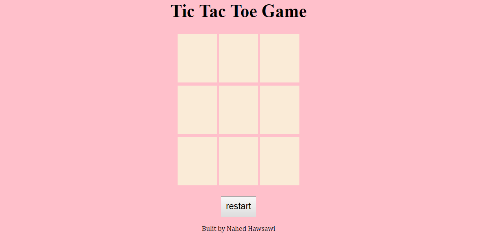

Project #1: Tick Tak Toe Game 
built by Nahed Hawsawi 

Welcome to Tic Tac Toe , This is a simple game that I created with javascript/jquery/html/css skills. Most of the games I have seen online require two players, I  tried to creating a game where one player plays .

1-set the player o or x .
2-allow human whether to play as x or o .
3-display message for winner .
4-Button to reset game .

How to play ??
When the game is loaded , the player click on cell to start play here the user will start with x then o ,by getting three in a row - either across, down, or diagonal.
in case of non player win the reset button will restart game .

Technology and Tooles used:
HTML 
CSS
JavaScript  
Jquary         

Further improvements:
1-Keep track of multiple game rounds with a win counter .
2-Allow players to customize their tokens ( name, picture, etc).
3-Support networked multiplayer .
4-Landing page with animtion effect ,emoji to the game display the winner .

-What was the most difficult part of the project?
javaScript coding (using event to call function )

-What was your favourite part to work on?
HTML and CSS

Resours and helpful:
https://www.w3schools.com/
https://developer.mozilla.org/en-US/
https://github.com/

Acknowledgements/Thanks :
Insturcurs :
Mr.Mickael Finneran- michael.finneran@generalassemb.
Mr.Usman Bashir - http://usmanbashir.com
Mr.Moath Althawad - moath.faisal@generalassemb.ly
Miss.Ghadeer 
My Colleagues(female - male ).
